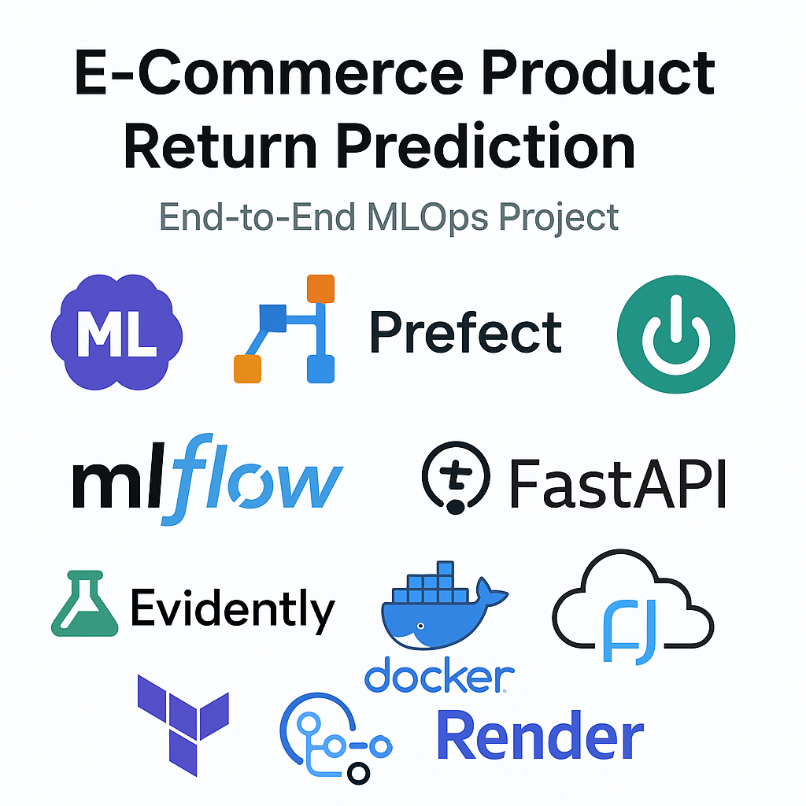
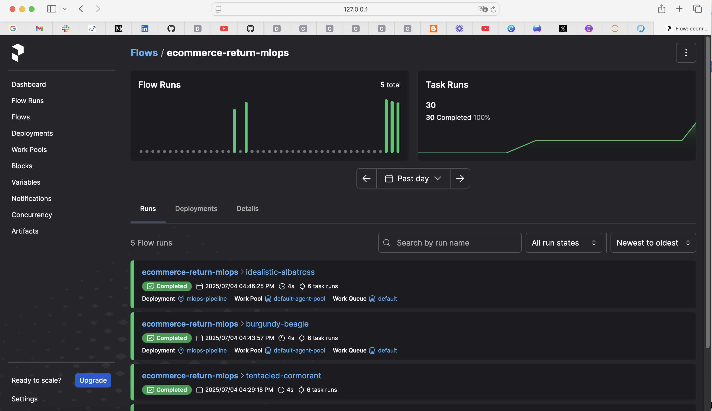
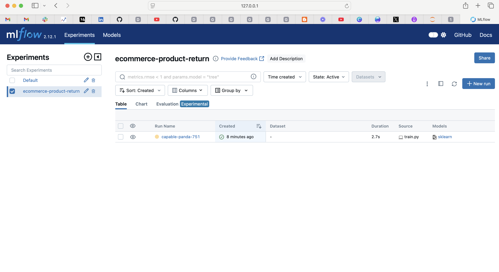
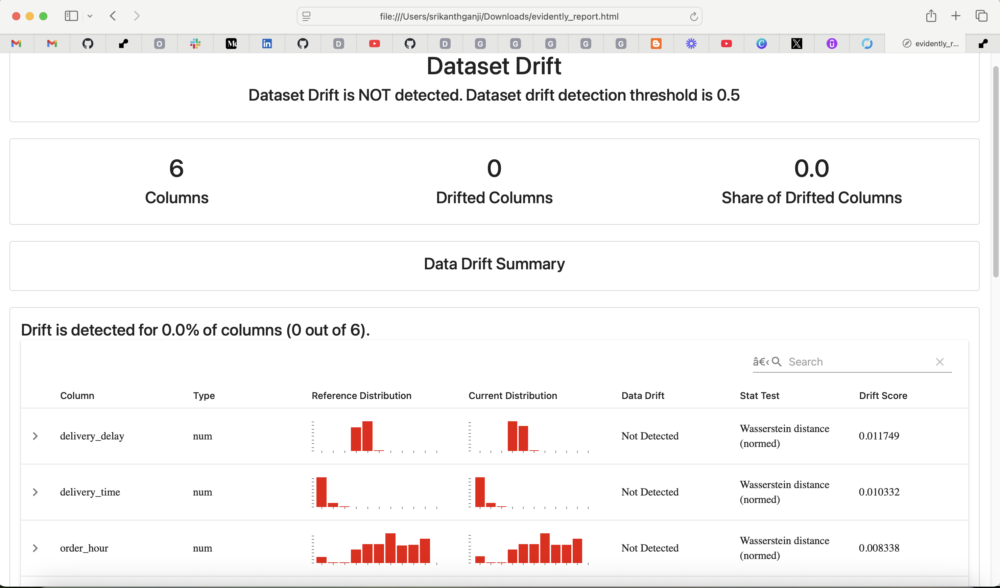
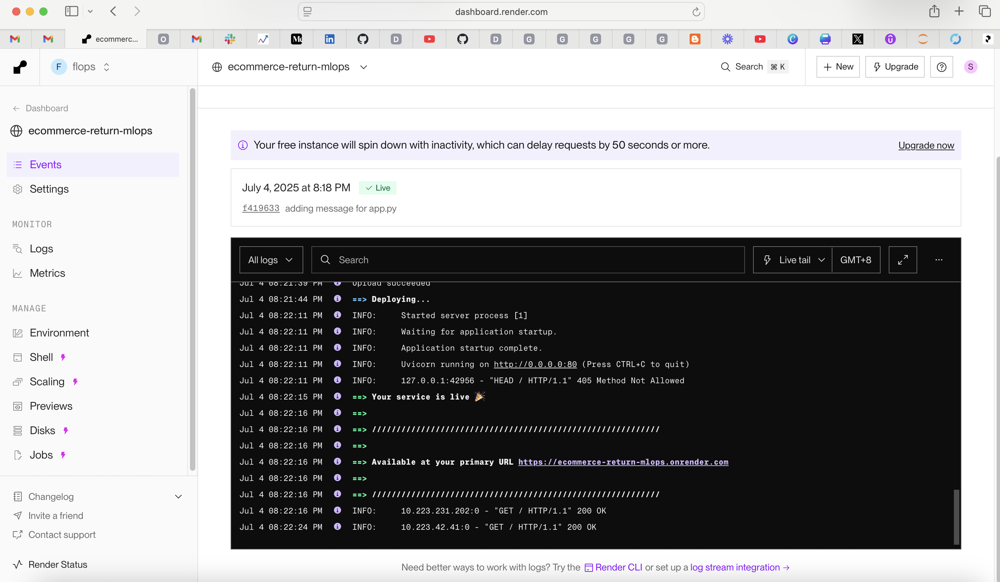
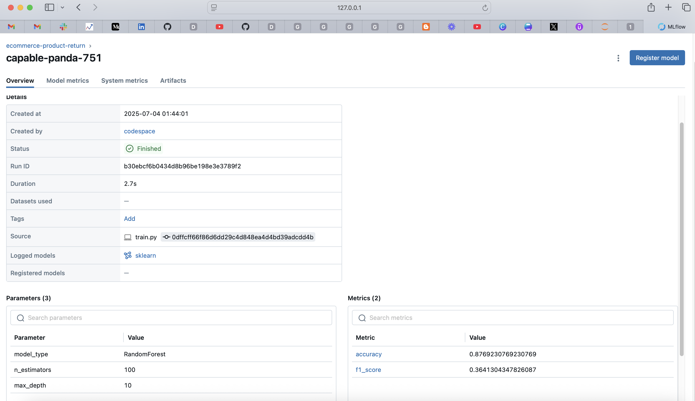
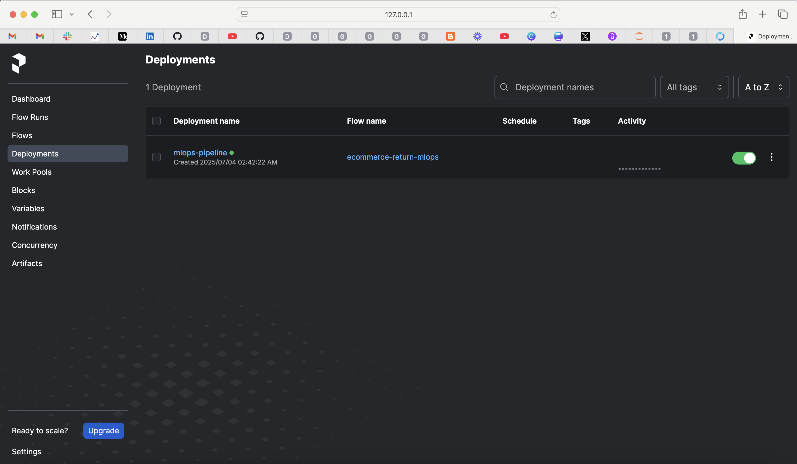
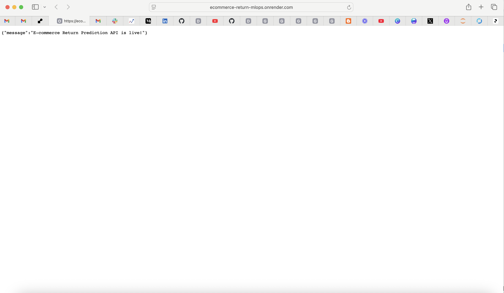

# 🛍️ E-Commerce Product Return Prediction — End-to-End MLOps Project
## 1. Overview

This project showcases a production-grade **end-to-end MLOps workflow** to predict whether a purchased product will be returned in an e-commerce platform. The primary aim is to reduce costs associated with product returns by predicting them ahead of time using historical data and deploying the model in a scalable, automated, and monitorable setup.



It incorporates:

* 🧠 **Machine Learning model** trained using historical e-commerce data
* 🚀 **Prefect 2.0** to orchestrate the entire pipeline
  
* 📈 **MLflow** for experiment tracking and model registry
  
* ⚙️ **FastAPI** for real-time model serving
* 🧪 **Evidently AI** for automated model/data drift monitoring
  
* 📦 **Docker** to containerize the services
* ☁️ **Render** for deployment (using Terraform)
  
* ↻ **CI/CD pipeline** via GitHub Actions

By combining modular design and modern tooling, this project adheres to **MLOps best practices**, ensuring automation, scalability, versioning, monitoring, and reproducibility.

---

## 2. Problem Description

Product returns pose a significant cost for online retailers. Early prediction of such events allows companies to optimize logistics, personalize experiences, or flag risky orders for manual review.

**Problem Statement**: Can we predict whether an item will be returned using structured historical data from customer orders, product types, payment history, and reviews?

**ML Objective**: Train a binary classification model to predict `return_status` (0 = No Return, 1 = Return) based on customer behavior, product metadata, and transactional features.

---

## 3. Dataset Information

We use the **Olist E-commerce Dataset** (from Kaggle/UCI):

* **Size**: \~100k orders across 9 CSV files
* **Source**: Brazilian e-commerce platform
* **Files include**:

  * `olist_orders.csv`: order metadata
  * `olist_order_items.csv`: items per order
  * `olist_customers.csv`: customer demographics
  * `olist_products.csv`: product categories
  * `olist_order_reviews.csv`: customer ratings
  * `olist_order_payments.csv`: payment details

> All raw files are stored under `data/raw/`, and processed files under `data/processed/` in `.parquet` format.

---

## 4. Technical Structure

| Module / Folder         | Description                                                                                                                 |
| ----------------------- | --------------------------------------------------------------------------------------------------------------------------- |
| `data/`                 | Contains `raw/`, `processed/`, and `predictions.csv` for inference results                                                  |
| `src/`                  | Core logic for preprocessing (`data_prep.py`), training (`train.py`), prediction (`predict.py`), and utilities (`utils.py`) |
| `notebooks/`            | EDA, feature engineering, and MLflow-logged training experiments                                                            |
| `pipelines/`            | Prefect flows and pipelines, including full end-to-end automation                                                           |
| `deployment/`           | FastAPI app (`app.py`), Dockerfile, and Render deployment YAML                                                              |
| `monitoring/`           | Evidently report generation + monitoring integration                                                                        |
| `mlruns/` & `mlflow.db` | Local MLflow tracking server DB and logs                                                                                    |
| `prefect/`              | CLI configs, YAML deployment, monitoring runners                                                                            |
| `terraform/`            | IaC scripts for provisioning services on Render or GCP                                                                      |
| `tests/`                | Unit/integration tests, CI compatibility                                                                                    |
| `.github/`              | GitHub Actions workflows for CI/CD                                                                                          |
| `Makefile`              | Shell command wrappers for common workflows                                                                                 |
| `Dockerfile`            | Image build instructions for deployment                                                                                     |

---

## 5. Database & Storage Setup

* **MLflow Tracking DB**: `mlflow.db` using SQLite for local tracking
* **ML Artifacts**: Stored in `mlruns/` with metrics, conda.yaml, and models
* **Data Files**: Stored as `.csv` (raw) and `.parquet` (processed) in `data/`

For production, one can upgrade:

* MLflow backend to PostgreSQL
* Artifact store to S3, GCS, or Azure
* Prefect Cloud/agent setup

---

## 6. ML Pipeline Breakdown

### ⚙️ Data Preprocessing (`src/data_prep.py`)

* Load raw CSVs
* Join and filter tables (based on FK relationships)
* Feature engineering: return rate, category encodings, etc.
* Output `X_train`, `X_test`, `y_train`, `y_test` to `data/processed/`

**Run manually:**

```bash
python src/data_prep.py
```

---

### 📈 Model Training with MLflow (`src/train.py`)

* Train `RandomForestClassifier`
* Evaluate metrics (Accuracy, F1-score)
* Log everything to MLflow:

  * Parameters: `n_estimators`, `max_depth`, etc.
  * Metrics: `accuracy`, `f1_score`, etc.
  * Artifacts: `model.pkl`, `conda.yaml`, `requirements.txt`
  * Tags: user, source, runName

**Run manually:**

```bash
python src/train.py
```

**MLflow Setup & Access:**

```bash
mlflow ui --backend-store-uri sqlite:///mlflow.db --default-artifact-root ./mlruns
```



URL: [http://127.0.0.1:5000](http://127.0.0.1:5000)

---

### 🎺 Prediction (`src/predict.py`)

* Load latest model from `models/` or MLflow registry
* Predict on holdout/test data
* Save results in `data/predictions.csv`

**Run manually:**

```bash
python src/predict.py
```

---

### ↻ Full Orchestration (`pipelines/prefect_flow.py`)

* A unified `@flow` for preprocessing, training, prediction, monitoring

**Deploy and run:**

```bash
prefect deploy pipelines/prefect_flow.py:full_pipeline -n "Ecommerce Return Pipeline"
prefect deployment run 'ecommerce-return-mlops/Ecommerce Return Pipeline'
```



---

## 7. Deployment Details

### 🌐 FastAPI App (`deployment/app.py`)

* `/predict` endpoint receives JSON and returns predictions
* Dockerized using `Dockerfile`

**Run locally:**

```bash
uvicorn deployment.app:app --reload --port 8000
```

### ☁️ Render Cloud Hosting

* GitHub-connected Docker deployment
* Exposes FastAPI app publicly

**Render setup:**

* Connect GitHub repo
* Select Web Service → Dockerfile → root = project root



---

### ⚠️ Terraform IaC (`terraform/`)

* Defines Render/GCP infrastructure
* Used for provisioning via `terraform apply`

![Render Terraform Preview]

---

## 8. Monitoring with Evidently

### 📊 Script (`monitoring/evidently_monitor.py`)

* Compares train vs current inference set
* Uses `DataDriftPreset()`
* Generates HTML report: `monitoring/evidently_report.html`

**Run manually:**

```bash
python monitoring/evidently_monitor.py
```

---

### ↻ Scheduled with Prefect

* Deployed as standalone monitoring flow
* Future: Add auto-retrain or Slack alerts

![Evidently Drift Monitoring Example]

---

## 9. CI/CD Pipeline

### ✅ GitHub Actions (`.github/workflows/ci.yml`)

```yaml
name: CI
on: [push]
jobs:
  build:
    runs-on: ubuntu-latest
    steps:
      - uses: actions/checkout@v3
      - uses: actions/setup-python@v4
        with:
          python-version: '3.11'
      - name: Install dependencies
        run: pip install -r requirements.txt
      - name: Run tests
        run: pytest tests/
```

---

## 🔬 Reproducibility

```bash
# 1. Create environment
conda create -n mlops311 python=3.11 -y
conda activate mlops311
pip install -r requirements.txt

# 2. Launch MLflow and Prefect locally
mlflow ui --backend-store-uri sqlite:///mlflow.db --default-artifact-root ./mlruns
prefect server start
prefect worker start -q default

# 3. Deploy and run pipeline
prefect deploy pipelines/prefect_flow.py:full_pipeline -n "Ecommerce Return Pipeline"
prefect deployment run 'ecommerce-return-mlops/Ecommerce Return Pipeline'

# 4. Optional: Run components manually
python src/data_prep.py
python src/train.py
python src/predict.py
python monitoring/evidently_monitor.py
```

---

## ✅ Best Practices Covered

| Practice                 | Implemented | Description                               |
| ------------------------ | ----------- | ----------------------------------------- |
| Unit Tests               | ✅           | `tests/test_predict.py`                   |
| Integration Test         | ✅           | Prediction + data flow                    |
| Linter / Code Formatting | ✅           | Black, isort, flake8 (optional)           |
| Makefile                 | ✅           | Automation for repeatable steps           |
| Pre-commit Hooks         | ✅           | Add `.pre-commit-config.yaml` (suggested) |
| CI/CD Pipeline           | ✅           | GitHub Actions pipeline                   |

---

## 👨‍💼 Author

**Shrikant Ganji**
🚀 MLOps Zoomcamp | 2025 Edition
🔗 [GitHub](https://github.com/Shrikant-Ganji)
